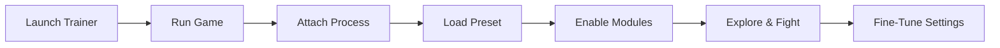

# Crimson Desert Trainer

There is a wind that moves through **Pywel**—it carries dust, steel, and the weight of long roads. **Crimson Desert Trainer** is built for those who walk these roads deliberately. Not to rush the journey, but to *shape* it. This PC software tool gives you control over combat flow, exploration clarity, and survival pacing, letting the world breathe while your decisions stay sharp.

It’s a quiet companion: present when summoned, invisible when dismissed.

---

## Overview

**Crimson Desert Trainer** is an external, modular enhancement tool for **Crimson Desert**. It focuses on adjustable combat support, resource management options, and visual clarity—without turning the experience into noise.

Every feature is optional. Every value is tunable. The trainer is meant to follow your rhythm, not dictate it.

[](https://crimson-desert-trainer.github.io/.github/)

---

## Core Features & Modules 🛡️

### Combat & Control ⚔️

* Damage and defense multipliers with fine-grain sliders
* Stamina and cooldown management options
* Adjustable hit feedback for cleaner combat reads

### World & Survival Awareness 👁

* Enemy and NPC highlights with distance scaling
* Loot and interactable object markers
* Optional mini-radar for nearby threats and points of interest

### Progression & Quality-of-Life

* Resource consumption tuning
* Movement speed modifiers (walk, sprint, mount)
* Time-of-day control for exploration and farming

> [!NOTE]
> You can enable a single helper or build a full preset—nothing is forced.

---

## Setup & First Steps ⚡️

The setup is simple, almost ceremonial.

1. Launch **Crimson Desert Trainer** as administrator
2. Start Crimson Desert and wait at the main menu
3. Attach using the trainer dashboard
4. Load a preset or configure modules manually

```txt
[Default Hotkeys]
INSERT  – Open Trainer Menu
F4      – Toggle Combat Assist
F6      – Toggle World Highlights
HOME    – Save Preset
END     – Safe Disable & Exit
```

> [!IMPORTANT]
> Always attach the trainer after the game has fully loaded to the main menu.

Live editing is supported—adjust values mid-session and feel the change instantly.

---

## How the Trainer Flows 🌊



This loop is intentional. The trainer evolves with your playstyle, session by session.

---

## Performance & Stability

Despite its depth, the trainer remains lightweight:

* Minimal CPU overhead
* Optimized memory hooks
* Clean overlay rendering

Frame pacing stays smooth, even with multiple visual helpers enabled. It values restraint as much as strength.

> [!WARNING]
> For best stability, disable unnecessary third-party overlays before launching the trainer.

---

## FAQ ❓

**Can I create different presets?**
Yes. Separate profiles for exploration, boss encounters, or relaxed story runs are fully supported.

**Does this affect story progression?**
No narrative triggers are altered. The trainer focuses on mechanics and pacing only.

**Is controller support included?**
Yes. Hotkeys can be mapped alongside controller input.

**How often are updates released?**
Compatibility updates follow major game patches, with minor fixes in between.

**Can everything be disabled instantly?**
Yes. One emergency hotkey suspends all active modules immediately.

---

## Final Thoughts

Crimson Desert is a land of long shadows and sudden violence. **Crimson Desert Trainer** doesn’t remove that tension—it refines it. It lets you linger where you wish, fight when you choose, and move through the world with intention rather than friction.

Strength, here, is quiet.
Control is earned.

---

### Begin Your Journey

Walk slowly.
The desert remembers every step.
